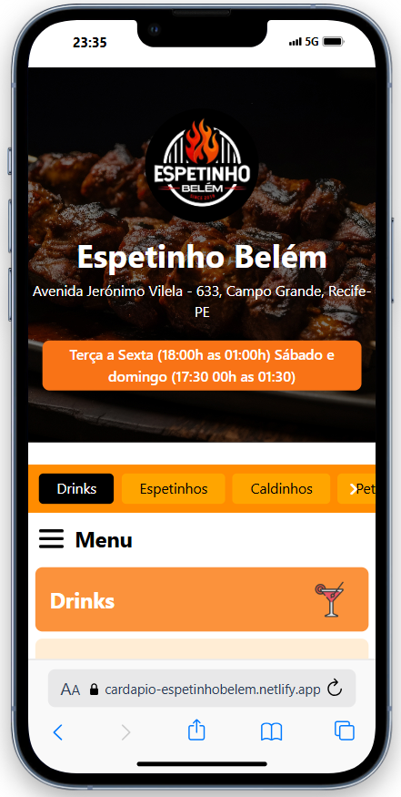

# 🍢 Cardápio Virtual para Espetinho

Um cardápio virtual interativo, feito com **HTML, CSS, JavaScript** e **Tailwind CSS**, que exibe promoções do dia de acordo com o dia da semana.

🔗 [Acesse o cardápio online](https://cardapio-espetinhobelem.netlify.app/)

---

## 🖼️ Captura de Tela

---

## ⚙️ Funcionalidades

- Exibe automaticamente o **dia da semana**
- Mostra a **promoção do dia**
- Layout responsivo com Tailwind CSS
- Estilo moderno e minimalista

---

## 📂 Tecnologias Utilizadas

- HTML5
- Tailwind CSS
- JavaScript (Vanilla)
